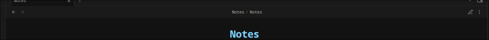
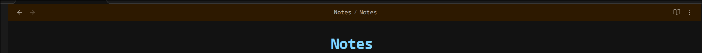

# Editor Mode Button

I made this extension because I was tired of the weird flow of editing and viewing Obsidian notes, where you could be editing one note and reading another, and you were never fully sure which mode new pages would open in.

Now, there's a clear separation between editing mode and reading mode.

## CSS

You can easily change how Obsidian looks in both modes. Just create a CSS file in your vault, and set its path in the settings.

```css
body.emb-mode-source .view-header {
	background-color: rgb(45, 25, 0) !important;
}

body.emb-mode-preview .view-header {
	background-color: var(--background-secondary);
}
```

All styles that should be visible in a specific mode should be placed either in the `body.emb-mode-source` selector (for editing mode), or in `body.emb-mode-preview` (for reading mode). The custom CSS will override the default styles.

### Default Reading Mode



### Default Editing Mode



## Ribbon Indicator

There's an indicator on the ribbon (menu on the right) that shows which mode you are in. You can click it to quickly switch modes, and when you do, all open files will change their mode too.


